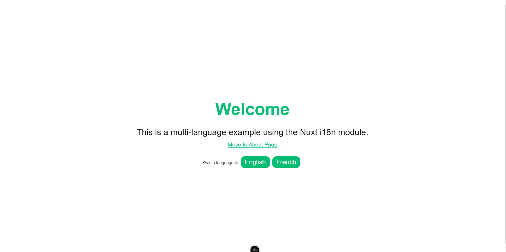
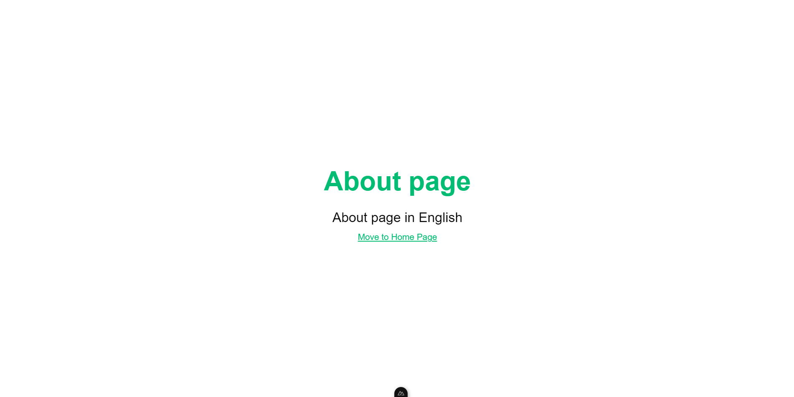
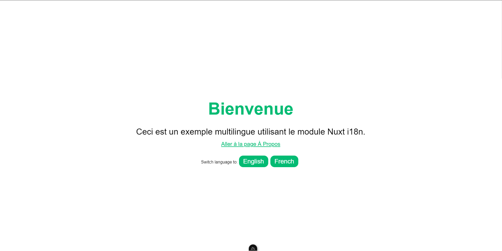
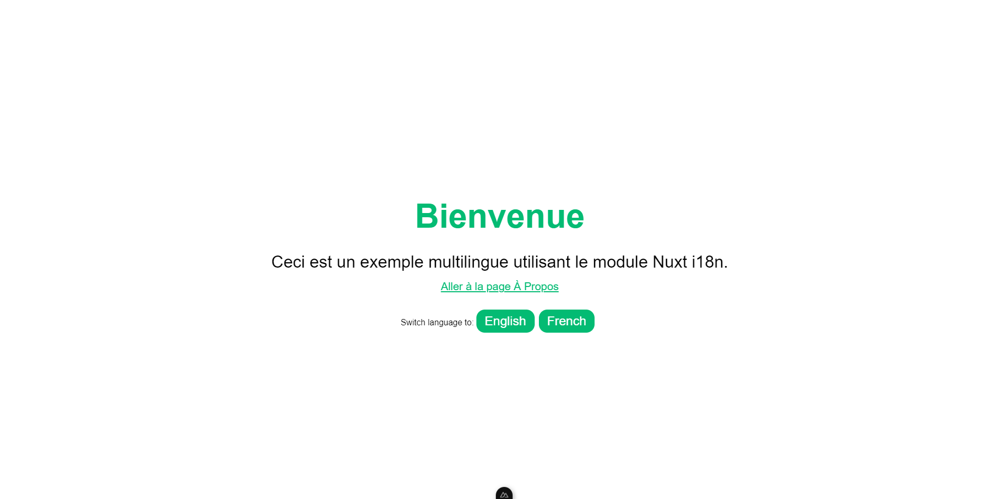

# Multi-languague Nuxt 3 app

Demo multi-language app using [Nuxt 3](https://nuxt.com/docs/getting-started/introduction) and [i18n](https://i18n.nuxtjs.org/docs/getting-started).

## Prerequisite

- Nodejs v20.15
- Yarn v1.22.22
- Nuxt 3
- i18n v8

## Installation

``` bash
git clone https://github.com/ltphat2204/nuxt-multi-languages.git
cd nuxt-multi-languages
yarn install
```

## Run

``` bash
yarn run dev
```

The app is running [here](http://localhost:3000/)

## Demo

### English

#### Home page



#### About page



### French

#### Home page



#### About page

